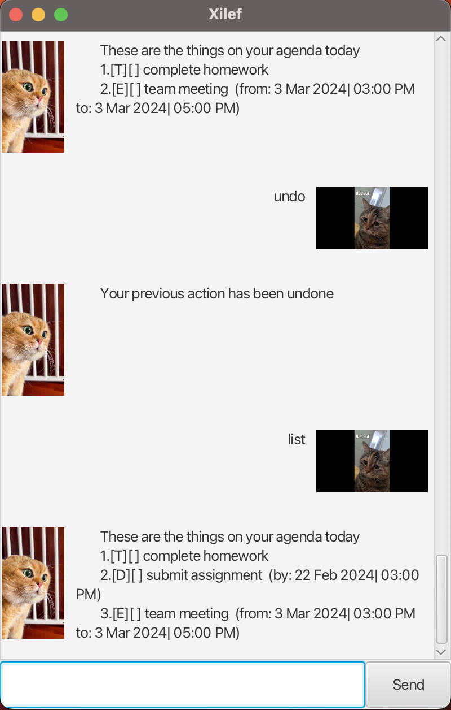

# Xilef User Guide


Welcome to the Xilef User Guide! Xilef is a powerful productivity tool designed to help you manage your tasks 
efficiently and stay organized. This guide will walk you through the various features and functionalities of Xilef to 
maximize your productivity.

## Adding a todo
To add a todo, simply input the descirption of the task.

Example: `todo complete homework`

Expected Output:
```
Added a new task to the list!
 [T][] comeplete homework
You have 1 too many task to do!!!
Quickly start working on them!!!
```
## Adding a deadline
To add a deadline, specify the description of the task followed by `/by` and the deadline date and time 
in the format YYYY-DD-MM HHmm.

Example: `deadline submit assignment /by 2024-22-02 1500`

Expected Output:
```
Added a new task to the list!
 [D][] submit assignment (by: 22 Feb 2024| 03:00 PM)
You have 2 too many tasks to do!!!
Quickly start working on them!!!
```
## Adding an event
To add an event, provide the description of the event followed by `/from` and the start datetime and 
`/to` and the end datetime in the format YYYY-DD-MM HHmm.

Example:
`event team meeting /from 2024-03-03 1500 /to 2024-03-03 1700`

Expected Output:
```
Added a new task to the list!
 [E][] team meeting (from: 3 Mar 2024| 03:00 PM to: 3 Mar 2024| 05:00 PM)
You have 2 too many tasks to do!!!
Quickly start working on them!!!
```
## Listing your tasks
To view your list of tasks, simply use the `list` command.

Example: `list`

Expected Output:
```
These are the things on your agenday today
1.[T][] complete homework
2.[D][] submit assignment (by: 22 Feb 2024| 03:00 PM)
3.[E][] team meeting (from: 3 Mar 2024| 03:00 PM to: 3 Mar 2024| 05:00 PM)
```

## Mark task as done
To mark a task as completed, use the `mark` command followed by the task number.

Example: `mark 1`

Expected Output:
```
Great job, you have accomplished this task:
 [T][X] complete homework
```

## Unmark task as done
To unmark a task as completed, use the `unmark` command followed by the task number.

Example:`unmark 1`

Expected Output:
```
Reminder, you have not completed this task yet:
 [T][] complete homework
```

## Finding tasks using a keyword
To find tasks you are interested in, use the `find` command followed by a keyword.

Example:`find team meeting`

Expected Output:
```
These are the matching tasks in your list:
1.[E][] team meeting (from: 3 Mar 2024| 03:00 PM to: 3 Mar 2024| 05:00 PM)
```

## Deleting a task
To delete a task, use the `delete` command followed by the task number.

Example:`delete 2`

Expected Output:
```
Removed the following task:
 [D][] submit assignment (by: 22 Feb 2024| 03:00 PM)
You now have 2 tasks remaining
```

## Undo your previous action
To undo the most recent command you have done, use the `undo` command. You will be able to undo as many
times as the number of commands you have input since you have started running the bot.

Example: `undo`

Expected Output:
```
Your previous action has been undone
```

## Exiting Xilef
To exit Xilef, simply use the `bye` command.

Example:`bye`

Expected Output:
```
Bye bye, see you next time!!!
```